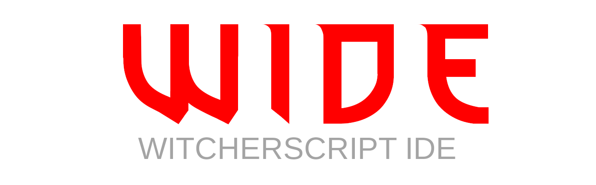

    

***WIDE*** (**W**itcherScript **I**ntegrated **D**evelopment **E**nvironment) is unofficial Witcher 3 modding tooling aimed at improving developer experience by supplying them with powerful code analysis tools in the form of an editor extension making use of a Language Server.

The goal is to provide a full set of features that the [ScriptStudio](https://witcher-games.fandom.com/wiki/Script_Studio) offers and more while at the same time being open-source.

Currently the only supported client is Visual Studio Code.

<https://spontancombust.github.io/witcherscript-ide>

## For users
WIDE is distributed in form of code editor extension. Currently only the VSCode extension is available.
Releases can be found in [Visual Studio Marketplace](https://marketplace.visualstudio.com/items?itemName=SpontanCombust.witcherscript-ide), [Open VSX Registry](https://open-vsx.org/extension/SpontanCombust/witcherscript-ide) or can be directly downloaded from the [releases](https://github.com/SpontanCombust/witcherscript-ide/releases) page.

Check out the [user manual](https://spontancombust.github.io/witcherscript-ide/user-manual) for more information.

## For developers

You can find information on building the project and contributions in the [developer section](https://spontancombust.github.io/witcherscript-ide/dev-manual) on the website.