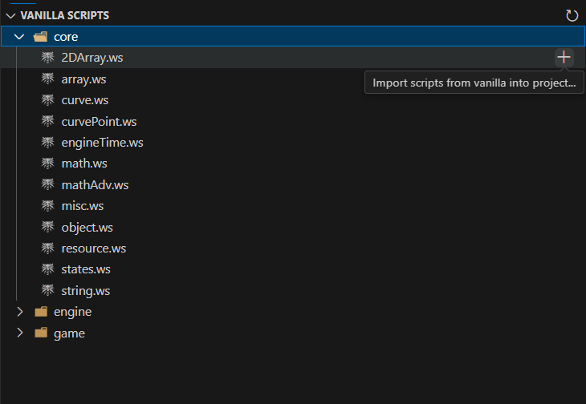

# Editor

## UI Elements

### Dashboard View

The primary view is the dashboard, which lets among other things create a script project and recompile game's scripts.

### Vanilla Scripts View

This view lets you see all available vanilla script files that you can import/checkout into your project.

### Contents View

Script "contents" or "packages" are seperate units of code that WIDE can recognize. These include custom WIDE projects, REDkit projects and raw Mod directories. You can learn more about the project system that WIDE uses [here](https://spontancombust.github.io/witcherscript-ide/user-manual/project-system/).

### Status Bar

Status bar displays context information about the last worked on project and any processes that might be going on currently in the background.

 

---

## Features

### Creating and initializing [script projects](./project-system.md)

:material-information-outline: Loading REDkit projects is also natively supported with some prior requirements outlined [here](./project-system.md#redkit-project).

### Syntax highlighting

### Basic syntax analysis

### Importing and comparing scripts with their vanilla counterparts

<video controls muted>
  <!-- TODO update the video with the process being done entirely through GUI -->
  <source src="../../assets/user-manual/editor/vanilla-import-diff.mp4" type="video/mp4"> 
</video>

### Hover tooltips

<video controls muted>
  <source src="../../assets/user-manual/editor/hover.mp4" type="video/mp4">
</video>

### Go to definition/declaration

<video controls muted>
  <source src="../../assets/user-manual/editor/goto-definition.mp4" type="video/mp4">
</video>

**More coming soon!**

 

---

## Command palette

### `witcherscript-ide.projects.init`
*"Initialize a WitcherScript project in existing directory..."*  
Will establish a basic file structure of a WitcherScript project in a given existing directory. Initial name of the project is picked based upon the directory name.

### `witcherscript-ide.projects.create` 
*"Create a new WitcherScript project..."*  
Will create a new directory and establish a basic file structure of a WitcherScript project inside it.

### `witcherscript-ide.scripts.importVanilla`
*"Import scripts from vanilla into project..."*  
Invokes a file chooser to pick vanilla scripts you want to import into your project. If more than one WitcherScript project exists in the workspace, prompts the user to choose the project.  
Command requires that the `content0` content is known and is a dependency to a given project.

### `witcherscript-ide.scripts.diffVanilla`
*"Compare script with vanilla counterpart"*  
Shows a difference view between the original vanilla script and the imported, modified script in the project.

### `witcherscript-ide.game.launchDx12`
*"Launch the game (DX12)"*
Launches the DirectX12 version of the game.

### `witcherscript-ide.game.launchDx12Debug`
*"Launch the game for debugging (DX12)"*
Launches the DirectX12 version of the game with arguments to enable debugging it.

### `witcherscript-ide.game.launchDx11`
*"Launch the game (DX11)"*
Launches the DirectX11 version of the game.

### `witcherscript-ide.game.launchDx11Debug`
*"Launch the game for debugging (DX11)"*
Launches the DirectX11 version of the game with arguments to enable debugging it.

### `witcherscript-ide.game.recompileScripts`
*"Recompile game scripts"*
Remotely connects to the game to trigger script recompilation.

### `witcherscript-ide.game.execConsoleCommand`
*"Execute console command"*
Remotely connects to the game to execute a command that would normally be entered in the debug console.

### `witcherscript-ide.misc.openLogs`
*"Open extension logs"*
Open WIDE's language client output view.

### `witcherscript-ide.misc.openSettings`
*"Open extension settings"*
Open the settings page on WIDE's section.

### `witcherscript-ide.debug.showScriptAst`
*"Show script AST"*  
Shows the Abstract Syntax Tree  of the currently focused on script as it is uderstood by the language server.
Warning: if document's identation is done with tabs instead of spaces it may not show accurate symbol span data.  
Requires [debug features](#witcherscript-idedebugenabledebugfeatures) to be enabled.

### `witcherscript-ide.debug.showScriptCst`
*"Show script CST"*  
Shows the Concrete Syntax Tree  of the currently focused on script as it is uderstood by the language server.
Warning: if document's identation is done with tabs instead of spaces it may not show accurate symbol span data.  
Requires [debug features](#witcherscript-idedebugenabledebugfeatures) to be enabled.

### `witcherscript-ide.debug.contentGraphDot`
*"Show content graph"*  
Shows the graph in Graphviz .dot format representing the overall content dependency graph of the workspace.  
Requires [debug features](#witcherscript-idedebugenabledebugfeatures) to be enabled.

### `witcherscript-ide.debug.showScriptSymbols`
*"Show script symbols"*  
Shows code symbols that have been extracted from the currently focused on script file.  
Requires [debug features](#witcherscript-idedebugenabledebugfeatures) to be enabled.

### `witcherscript-ide.debug.clearGlobalState`
*"Clear global persistent data"*  
Clears global VSCode extension database entries created by the client. Useful mostly for testing.
Requires [debug features](#witcherscript-idedebugenabledebugfeatures) to be enabled.

 

---

## Configuration

### `witcherscript-ide.gameDirectory`
Path to Witcher 3's root game directory (containing bin, content, Mods folders etc.). This will effectively add `content` and `Mods` folders to content repositories.

### `witcherscript-ide.contentRepositories`
Paths to custom directories containing WitcherScript contents. Useful when not having Witcher 3 installed on your local machine or when simply storing scripts outside of game directory.

### `witcherscript-ide.gameHostIpAddress`
IPv4 address of the game host. It is used when running remote game commands such as script recompilation. Change this if you're running the game on a different computer from the one you're currently working in VSCode. Defaults to the localhost address.

### `witcherscript-ide.languageServer.enable`
Enable the language server. True by default.  You can disable this if you only want syntax highlighting. Change requires extension reload.

### `witcherscript-ide.languageServer.syntaxAnalysis`
Enable syntax analysis in the language server. True by default. This may require window reload if there are unresolved syntax analysis related diagnostics present.

### `witcherscript-ide.languageServer.rayonThreads`
Number of threads allocated to parallel data computation. Leave at 0 for automatic configuration. Change requires extension reload.

### `witcherscript-ide.debug.enableDebugFeatures`
Enables debug features used for development. False by default. Change requires extension reload.
